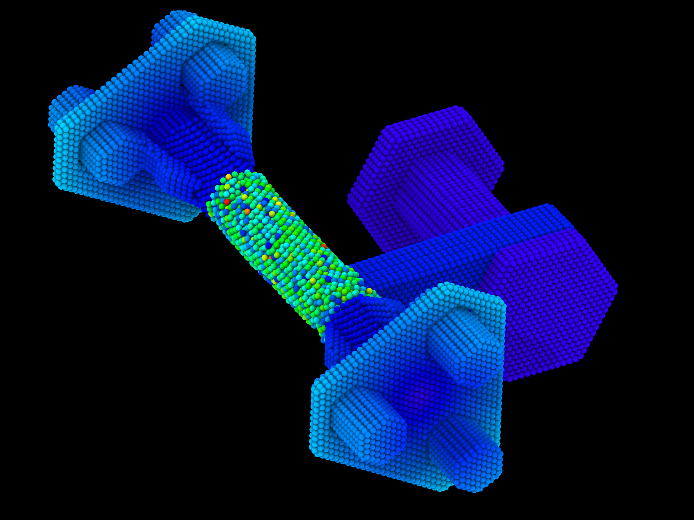

# Molecular Dynamics Simulation of Diamond Turning (Lathe Machining) of a Cu Workpiece — Hybrid EAM/Morse Potential

<p align="center">
  
  
  
  
  
  
  
</p>

<p align="center">
  A fully atomistic <b>molecular dynamics model of single-point diamond turning</b> --
  a rigid diamond fixture (a fixed <b>rail</b>, a sliding <b>tool</b> carriage, and two
  synchronized, rotating <b>grippers</b>) machining a <b>Cu workpiece rod</b> clamped
  between the grippers' collets. The diamond fixture is imported from a SAMSON CAD
  export and driven purely kinematically (<code>fix move</code>); the Cu rod is built
  directly in LAMMPS as an EAM lattice and responds via real Cu-Cu forces. A four-stage
  motion sequence -- axial reposition, radial infeed, spin-up dwell, then the actual
  cutting pass -- brings the tool to depth and lets rotation propagate into the
  workpiece before any material is removed.
</p>

<p align="center">
  <b>This project went through several rounds of real, measured bugs -- not hypothetical
  edge cases.</b> Read <a href="#known-open-issues">Known Open Issues</a> and
  <a href="#common-errors-and-fixes">Common Errors and Fixes</a> before trusting any
  output from this pipeline; the two most serious fixes below were only confirmed
  correct after a real LAMMPS run and a real OVITO screenshot showed the tool traveling
  toward the wrong place -- not caught by code review alone.
</p>

<p align="center">
  
</p>

---

## Known Open Issues

**1. Diamond<->Cu contact potential is an unvalidated placeholder.** The Morse
parameters used for C-Cu and H-Cu contact (`0.40 2.20 2.90 6.0` and
`0.10 2.00 2.50 6.0`) were chosen to be qualitatively repulsive (a WCA-like "hard
wall"), not fit to any literature reference or DFT data -- no validated diamond-Cu
interatomic potential was available for this project. Cutting *mechanism* (plowing,
pile-up, localized heating) should look qualitatively right; cutting forces, chip
thickness, and temperatures should **not** be trusted quantitatively until this is
replaced.

**2. The rail/tool/gripper chain mapping was inferred, not confirmed against the
original CAD labels.** `convert_diamond_fixture.py` assigns each of the 15 PDB chains
(A-O) to a functional part (rail, tool, gripper fingers/hub/collet) using bounding-box
geometry, a fitted rotation axis, and a closest-approach-to-axis calculation -- not
metadata from the source CAD. It is geometrically self-consistent (see Development
Notes) and partially corroborated by real OVITO renders showing plausible gripper
shapes, but has not been checked against SAMSON's own part names.

**3. No LAMMPS installation was available during development to execute this script
end-to-end.** Every numeric fix below (the axial travel-distance corrections, the
`fix halt` safety net) is a reasoned correction to a script run on the user's own
machine, verified by hand-computing the tool's real geometric extent -- not by an
independent completed run on the development side.

**4. A diffuse/scattered-looking Cu workpiece was observed in one real OVITO
screenshot** (colored by velocity magnitude, mid-run) instead of a coherent rotating
cylinder. This has not been diagnosed. It may be genuine severe plastic flow from the
cut, or a sign of numerical trouble (spin-up torque applied too abruptly at the
clamped/free boundary, or the placeholder Morse parameters being too stiff or too
soft). Check this before trusting downstream results from a full run.

## Development Notes

This pipeline was built iteratively against a real LAMMPS run log and a real OVITO
screenshot, and more than one fix was needed before the actual cause was found:

- **A real run failed with `Atom IDs must be consecutive for velocity create loop
  all`.** Root cause, visible directly in the same run's own output
  (`WARNING: Ignoring 'compress yes' for molecular system`): `delete_atoms overlap`
  removes atoms but will not auto-renumber IDs for a "molecular" `atom_style` like
  `full`, leaving gaps that `velocity create`'s default loop mode can't handle. Fixed
  with `reset_atoms id` immediately after `delete_atoms`.
- **`delete_atoms overlap` deletes atoms from whichever group is listed *first*, not
  from an arbitrary side of the pair.** Confirmed directly against the LAMMPS
  documentation before writing the script (`delete_atoms overlap 2.0 diamond_all
  workpiece_all` correctly carves atoms out of the diamond collet jaws, not out of the
  newly created Cu rod) -- getting the group order backward would have silently deleted
  the workpiece instead.
- **`dump_modify ... element` does not work with `dump style custom`,** only `cfg`,
  `xyz`, and `image` -- confirmed against the documentation before shipping, and
  removed from the dump setup (atom types are mapped to elements manually in OVITO
  instead).
- **A travel-distance safety check that only used the tool's centroid was wrong, and
  the wrongness was only caught by a real OVITO screenshot.** The tool's axial
  reposition-and-feed path was first checked only against where its *center point*
  would end up relative to the free-span boundary -- which showed a comfortable 5.1 A
  clearance. After a real run and OVITO render showed the tool visibly reaching toward
  a gripper, re-deriving the check using the tool's *actual body extent* (it is ~18 A
  wide along the travel direction) showed the true leading edge overshooting the
  boundary by ~3.8 A. The centroid-only check was replaced with an edge-aware one.
- **Rather than re-trust a third hand-calculated margin, a live runtime safety net was
  added instead of another static number.** `fix halt` now watches
  `compute reduce min/max y` on the tool's *actual simulated atoms* every 200 steps for
  the whole run, and kills the run if either edge gets within a hard 2 A buffer of a
  gripper boundary -- independent of whether any of the hand-computed travel distances
  above are still correct.

## Design Decisions and Why

| # | Decision | Why |
|---|----------|-----|
| 1 | Diamond fixture (rail, tool, both grippers) driven purely kinematically via `fix move`, never integrated by `nve` | Its internal C-C/C-H/H-H forces are never needed once every atom's motion is prescribed -- lets the whole fixture be excluded from the neighbor list (`neigh_modify exclude group diamond_all diamond_all`), which is far cheaper than a real AIREBO diamond potential |
| 2 | `hybrid/overlay eam/alloy + morse` pair style, real EAM only for Cu-Cu | `CuAlW.txt` (Cu-Al-W EAM/alloy) supplies real Cu-Cu physics for the workpiece; Morse supplies a purely repulsive placeholder contact force for diamond<->Cu, since no fitted potential for that pair was available (see Known Open Issues) |
| 3 | Each PDB chain (A-O) kept as its own molecule ID through the SAMSON-to-LAMMPS conversion | Lets every functional part (rail, tool, each gripper's fingers/hub/collet) be grouped and driven independently without hand-editing coordinates |
| 4 | Workpiece rod split into `clamped_left` / `free` / `clamped_right` by y-slab, with the clamped ends unioned into the *same* rigid-motion group as their gripper | Standard boundary-atom technique from atomistic machining literature: the clamped ends co-rotate exactly with the gripper, while the free span responds only through real Cu-Cu EAM forces at that interface |
| 5 | Four sequential stages -- axial reposition, radial infeed, spin-up dwell, then the cutting pass -- rather than combining any of them | Isolates every contact-risk motion to one degree of freedom at a time (reposition can't cause contact since radial clearance hasn't changed yet); the dwell lets rotational torque propagate into the free span via real forces before axial feed starts, avoiding cutting into a workpiece whose rotation is still a transient |
| 6 | `fix halt` on `compute reduce min/max y` of the tool's real atoms, in addition to (not instead of) the hand-computed travel bounds | A static pre-computed clearance check has already been wrong twice in this project; a live check on the actual simulated positions doesn't depend on that arithmetic being right |
| 7 | `reset_atoms id` immediately after `delete_atoms overlap` | LAMMPS does not auto-compress atom IDs after deletion for a "molecular" `atom_style` like `full`, and non-consecutive IDs break `velocity create`'s default loop mode |
| 8 | Placeholder purely-repulsive Morse for diamond-Cu contact, explicitly flagged rather than presented as validated | No literature-fit interatomic potential for this specific contact was available in the supplied files; qualitative mechanism should be trustworthy, quantitative forces/temperatures should not (see Known Open Issues) |

## Simulation Overview

| Property | Value |
|----------|-------|
| Diamond fixture material | C, H (hydrogen-terminated diamond; rail, tool, both grippers) |
| Workpiece material | Cu (Zhou-style EAM/alloy, `CuAlW.txt`, Cu block only) |
| Fixture source | SAMSON 2026 R1 CAD export, `lathe_diamond_parts.pdb`, 15 chains (A-O) |
| Fixture atom count | 56,268 (C/H) |
| Workpiece atom count (as created) | 6,323 (Cu, FCC, a0 = 3.615 A) |
| Atoms removed carving the collet bore | 3,176 (diamond atoms overlapping the new Cu rod) |
| Total atom count (post carve) | 59,415 |
| Simulation box | x [-119.9, 97.3], y [-169.1, 127.1], z [-64.9, 78.4] A |
| Boundary conditions | `f f f` -- finite, non-periodic fixture + workpiece |
| Spindle (rotation) axis | line parallel to y through (x=-50.0, z=6.8) |
| Workpiece rod radius | 12.0 A |
| Workpiece rod extent (y) | -105.0 to 63.0 A (clamped-left / free / clamped-right) |
| Free (exposed, cuttable) span | -67.2 to 25.1 A (92.3 A long) |
| Timestep | 0.001 ps (1 fs) |
| Equilibration temperature | 300 K, `nve` + `langevin` on the free workpiece span only |
| Depth of cut | 3.0 A beyond first contact (tool tip closest-approach measured at 21.83 A from axis) |
| Spindle period | 150 ps/revolution (~0.5 A/ps surface speed at the rod's outer radius) |
| Axial feed rate | 0.3 A/ps |
| Cutting pass length (this run) | y = -53.0 -> +7.0 (60 A of centroid travel, 5.2-9.1 A edge clearance from either gripper boundary) |
| Safety net | `fix halt` on live `min`/`max` y of the tool group, 2 A hard-stop buffer, checked every 200 steps |

## System Geometry

```
y (spindle / rail axis) ------------------------------------------------->

  LEFT GRIPPER                                              RIGHT GRIPPER
  K,L,M fingers          clamped     FREE (exposed,        clamped        F,G,H fingers
  N hub, O collet        Cu end      cuttable) Cu span     Cu end         I hub, J collet
      ||||                ####       ..................     ####                ||||
 <====####================####=======[ tool cuts here ]====####================####====>
      ||||                ####       ..................     ####                ||||
  y=-144.1 .. -67.2   y=-105..-67.2      y=-67.2..25.1    y=25.1..63     y=25.1 .. 102.1

  <-- rotates (spin_left) -->                              <-- rotates (spin_right) -->
              synchronized: same axis, same direction, same 150 ps period

                                        ^
                                        |  radial infeed (x,z), 12.83 A total
                                        |
                              TOOL (chains A,E) -- slides along y, 0.3 A/ps
                              RAIL  (chains B,C,D) -- fixed once infeed completes
```

## Simulation Phases

```
CAD Export (SAMSON)  (lathe_diamond_parts.pdb: rail, tool, 2 rotating grippers,
  15 chains A-O, C/H atoms only, collets modeled fully closed -- no bore)
      |
      v
Python Geometry Conversion  (convert_diamond_fixture.py: chain -> molecule ID,
  atom_style full data file, padded box -> diamond_fixture.data)
      |
      v
LAMMPS Initialization  (units metal; read_data; lattice fcc 3.615;
  region cylinder along the fitted spindle axis; create_atoms type 3 -> Cu rod)
      |
      v
Group Definition  (rail, tool, gripper_left/right_diamond, diamond_all,
  workpiece_all -- by molecule ID / atom type)
      |
      v
Safety Net Setup  (compute reduce min/max y on 'tool'; fix halt x2 -- a live
  circuit-breaker independent of any hand-calculated travel margin)
      |
      v
Pair Style + Carve Bore  (hybrid/overlay eam/alloy [CuAlW.txt] + morse;
  neigh_modify exclude diamond-diamond; delete_atoms overlap carves the
  originally fully-closed collet jaws open around the new Cu rod;
  reset_atoms id repairs the resulting ID gaps)
      |
      v
Workpiece Subdivision  (clamped_left / free / clamped_right by y-slab;
  spin_left = gripper_left_diamond + clamped_left, spin_right likewise)
      |
      v
Stage 1 -- Equilibration  (fixture frozen; free Cu span equilibrates to
  300 K via nve + langevin)
      |
      v
Stage 2a -- Axial Reposition  (tool only, y-direction, rail still frozen --
  zero contact risk since radial clearance hasn't changed)
      |
      v
Stage 2b -- Radial Infeed  (rail+tool together, x/z only, engages the tool
  tip to target depth of cut)
      |
      v
Stage 2c -- Spin-Up Dwell  (grippers + their clamped Cu ends start rotating;
  tool holds still at depth; torque propagates into the free span)
      |
      v
Stage 3 -- Cutting Pass  (tool feeds axially at fixed depth while rotation
  continues; free Cu span is cut / plastically deformed)
      |
      v
Final Structure  ->  final_state.data + dump.lathe_cutting.*.lammpstrj
  (final_state.data is also written if fix halt triggers early)
```

## Repository Structure

```
diamond_lathe/
|
├── convert_diamond_fixture.py   # PDB -> LAMMPS data converter: preserves each SAMSON
|                                #   chain as a molecule ID, pads the box, prints a
|                                #   geometry summary (bboxes, chain->molecule map)
├── lathe_cutting.in              # LAMMPS input script: adds the Cu workpiece, defines
|                                #   all groups/safety net, runs the 4-stage motion
├── lathe_diamond_parts.pdb       # Source CAD export (SAMSON 2026 R1): rail, tool,
|                                #   2 rotating grippers -- 15 chains, C/H atoms only
├── diamond_fixture.data          # Generated LAMMPS data file (56,268 atoms, 3 atom
|                                #   types reserved, molecule ID = chain)
├── CuAlW.txt                     # EAM/alloy potential file (user-supplied -- only the
|                                #   "Cu" block is used here; NOT included in this repo)
├── README.md                     # This file
|
└── output/                       # Generated on run
    ├── dump.lathe_cutting.*.lammpstrj  # Trajectory, every 2000 steps: id,mol,type,
    |                                   #   x,y,z,vx,vy,vz,c_pe_atom
    └── final_state.data                # Final structure (write_data) -- also written
                                         #   if fix halt triggers an early safety stop
```

## Requirements

- LAMMPS -- standard build, no extra packages needed for `eam/alloy`, `morse`, or
  `fix halt`: https://www.lammps.org
- `CuAlW.txt` -- Cu-Al-W EAM/alloy potential file (user-supplied; only the "Cu" block
  is used by this script -- see References for how to cite your specific source)
- Python 3 with `numpy` (only needed for the one-time PDB -> data conversion)
- OVITO for visualization: https://www.ovito.org

## Installation

```bash
# LAMMPS via conda-forge
conda install -c conda-forge lammps

# Python dependency for the one-time conversion script
pip install numpy
```

## Running the Simulation

```bash
# 1. (Already run once to produce diamond_fixture.data -- re-run only if you
#    regenerate the source PDB from SAMSON with different geometry)
python3 convert_diamond_fixture.py lathe_diamond_parts.pdb diamond_fixture.data

# 2. Put CuAlW.txt next to lathe_cutting.in, then run LAMMPS
lmp -in lathe_cutting.in
# or, for speed:
mpirun -np 4 lmp -in lathe_cutting.in

# 3. Visualize dump.lathe_cutting.*.lammpstrj in OVITO
```

Check the printed chain -> molecule-ID map and group atom counts at startup before
committing to a long run -- if `rail`, `tool`, `gripper_left_diamond`, or
`gripper_right_diamond` comes back with an unexpected count, the geometric part
mapping (see Known Open Issues, #2) needs re-checking against your own CAD.

## Simulation Parameters

### Geometry (`convert_diamond_fixture.py` / `lathe_cutting.in`)

| Variable | Meaning | Default |
|----------|---------|---------|
| `axis_x0`, `axis_z0` | Spindle (rotation) axis location | -50.0, 6.8 A |
| `wp_radius` | Workpiece rod radius | 12.0 A |
| `y_left_end`, `y_right_end` | Full workpiece rod extent | -105.0, 63.0 A |
| `y_gap_left`, `y_gap_right` | Free (exposed) span boundaries | -67.2, 25.1 A |
| `clearance` | Measured tool-tip closest-approach to axis minus workpiece radius | 9.83 A |
| `depth_of_cut` | Extra plunge beyond first contact | 3.0 A |

### Motion (`lathe_cutting.in`)

| Variable | Meaning | Default |
|----------|---------|---------|
| `dt` | Integration timestep | 0.001 ps |
| `T0` | Equilibration/bath temperature | 300.0 K |
| `y_cut_start` | Reposition target (pass start, tool centroid) | -53.0 A |
| `tool_half_lead`, `tool_half_trail` | Tool body half-extent used in the edge-aware travel check | 9.0, 9.0 A |
| `safety_margin` | Extra buffer beyond the bare-minimum edge clearance | 5.0 A |
| `reposition_time` | Duration of the axial reposition move | 20.0 ps |
| `infeed_time` | Duration of the radial infeed move | 20.0 ps |
| `spindle_period` | Time per gripper revolution | 150.0 ps |
| `dwell_time` | Spin-up dwell before axial feed starts | 225.0 ps (~1.5 rev) |
| `feed_rate` | Tool axial travel speed during the cut | 0.3 A/ps |
| `cut_time` | Length of the cutting pass | 200.0 ps |
| `safety_gap` | `fix halt` hard-stop buffer (live, atom-based) | 2.0 A |

### Contact Model

| Parameter | Meaning | Value |
|-----------|---------|-------|
| Pair style | `hybrid/overlay eam/alloy morse` | -- |
| Cu-Cu | `eam/alloy`, `CuAlW.txt`, Cu block | real, literature potential |
| C-C / C-H / H-H (diamond internal) | `morse 0.0 ...` | zero -- unused, excluded from the neighbor list entirely |
| C-Cu | `morse 0.40 2.20 2.90 6.0` | **placeholder**, purely repulsive (see Known Open Issues #1) |
| H-Cu | `morse 0.10 2.00 2.50 6.0` | **placeholder**, purely repulsive (see Known Open Issues #1) |

## Visualization in OVITO

1. **File -> Load File** -- open `diamond_fixture.data` to check the source geometry
   alone, or load `dump.lathe_cutting.*.lammpstrj` as a trajectory for the full run.
2. **Color by "Molecule Identifier" first**, before trusting any part label in this
   README -- confirm the rail/tool/gripper chain mapping visually against your own CAD
   (see Known Open Issues, #2).
3. **Color by "Particle Type" or "Velocity Magnitude"** to distinguish diamond
   (types 1,2) from Cu (type 3), and to spot the free workpiece span heating up as the
   tool passes.
4. **Select the `tool` group (molecule IDs 1, 5) at the last frame and check its
   bounding box** against the gripper geometry before trusting a completed run --
   this is exactly the check that caught the leading-edge overshoot bug (see
   Development Notes).
5. **Watch for chip pile-up ahead of the tool tip** and for a temperature/velocity
   spike right as spin-up dwell begins -- both are expected signatures of the cutting
   mechanism working as intended.

## What to Expect

**Stage 1 (equilibration):** nothing visibly moves; only the free Cu span's
temperature (via `c_temp_free`) settles toward 300 K.

**Stage 2a-2b (reposition, infeed):** the whole rail+tool assembly translates a short
distance; in the last few ps of infeed, `pe` and `press` should tick up as the tool
tip engages the workpiece surface.

**Stage 2c (dwell):** grippers spin up; expect a transient temperature/velocity
increase right at the clamped/free Cu boundary as torque propagates inward, which
should partially settle before the cutting pass begins.

**Stage 3 (cutting pass):** expect continuous plowing/displacement of Cu near the tool
tip, likely a helical groove and a small pile-up ahead of the tip, and further
localized heating. Given the placeholder contact potential (Known Open Issues #1),
trust the qualitative mechanism, not absolute force/temperature/chip-thickness values.

## Common Errors and Fixes

| Error / Symptom | Cause | Fix |
|------------------|-------|-----|
| `ERROR: Atom IDs must be consecutive for velocity create loop all` | `delete_atoms overlap` leaves gaps in atom-ID numbering; it will not auto-compress for a "molecular" `atom_style` like `full` | Add `reset_atoms id` immediately after `delete_atoms` |
| `pair_coeff` "not all coeffs are set" for the `hybrid/overlay` pair style | Internal diamond pairs (C-C, C-H, H-H) are `NULL` in the `eam/alloy` call and need *some* coefficient from the other substyle, even though `neigh_modify exclude` skips them at runtime | Add zero-strength placeholder `morse` coefficients for those three pairs |
| Tool assembly silently overlaps a gripper's diamond parts, with no LAMMPS error | Diamond-diamond forces are intentionally excluded from the neighbor list for speed, so two rigid diamond bodies scripted to occupy the same space produce no repulsive force at all | Use an edge-aware travel check (tool's actual body extent, not just its centroid) *and* the live `fix halt` safety net -- don't rely on either alone |
| Travel-distance check "passes" but the tool still visibly reaches a gripper in OVITO | The check used the tool's centroid position only, ignoring that the tool body itself is ~18 A wide along the travel direction | Recompute clearance using the tool's leading/trailing edges (centroid +/- half-extent), not the centroid alone |
| `dump_modify` errors or silently does nothing when using the `element` keyword with `dump style custom` | `element` only applies to `cfg`, `xyz`, and `image` dump styles | Remove the `element` modifier; map atom types to elements manually when visualizing |
| `delete_atoms overlap` removes the wrong material (e.g. the newly created workpiece instead of the fixture) | The **first** group listed is the one atoms get deleted from, not an arbitrary side of the pair | List the group you want carved *away* first: `delete_atoms overlap 2.0 diamond_all workpiece_all` |

## Extending the Simulation

| Extension | What to Change |
|-----------|-----------------|
| Replace the placeholder diamond-Cu contact | Swap the `morse` coefficients in the Contact Model table for a literature-fit or DFT-derived C-Cu/H-Cu potential -- see Known Open Issues #1 |
| Confirm the rail/tool/gripper mapping | Re-check `convert_diamond_fixture.py`'s printed chain-bbox summary against SAMSON's own part names, not just geometry -- see Known Open Issues #2 |
| Tune material removal rate | Vary `feed_rate`, `depth_of_cut`, or `spindle_period` in `lathe_cutting.in` |
| Facing / grooving instead of longitudinal turning | Change the Stage 3 feed vector from axial (y) to radial (x,z) |
| Threading | Couple the axial feed to the rotation phase instead of running it at constant velocity |
| Other tool-driven processes (indentation, scratching, drilling, milling, FSW, rolling, extrusion) | Same rigid-`fix move` + hybrid-potential framework applies -- only the motion recipe and which body is rigid vs. deformable change |
| Diagnose the diffuse-workpiece observation | Re-run with a shorter `dwell_time`/`spindle_period` ramp, or check whether the Morse parameters are too stiff, before trusting a full production run -- see Known Open Issues #4 |
| Crystallographic realism | Orient the Cu lattice (e.g. `lattice fcc 3.615 orient ...`) so a specific crystal direction lies along the spindle axis, matching real diamond-turning literature setups |

## Citation

If you use this simulation pipeline in your research, please cite:

```bibtex
@software{moore_mishra_diamond_lathe_md,
  author    = {Moore, T. and Mishra, Akshansh},
  title     = {Molecular Dynamics Simulation of Diamond Turning (Lathe Machining) of a Cu Workpiece -- Hybrid EAM/Morse Potential},
  year      = {2026},
  publisher = {Zenodo},
  doi       = {10.5281/zenodo.22160720},
  url       = {https://doi.org/10.5281/zenodo.22160720}
}
```

Plain text citation:

> Moore, T., & Mishra, A. (2026). *Molecular Dynamics Simulation of Diamond Turning
> (Lathe Machining) of a Cu Workpiece — Hybrid EAM/Morse Potential* [Computer
> software]. Zenodo. https://doi.org/10.5281/zenodo.22160720

## References

- **`CuAlW.txt`** -- Cu-Al-W EAM/alloy potential file (user-supplied). _Add the actual
  source citation here (e.g. the original Zhou et al.-style paper or repository this
  file came from) -- it is not included in this README because its specific origin
  wasn't available at write time; please don't leave a fabricated reference in its
  place._
- **SAMSON** -- CAD environment used to design and export the diamond fixture
  (`lathe_diamond_parts.pdb`). See https://www.samson-connect.net for the software;
  add a specific version/citation if your institution's license terms require one.

## License

This work is licensed under a [Creative Commons Attribution-NonCommercial 4.0
International License (CC BY-NC 4.0)](https://creativecommons.org/licenses/by-nc/4.0/).

You are free to share and adapt this material for non-commercial purposes, with
appropriate credit to the authors (see Citation above). Commercial use requires
separate permission from the authors.
